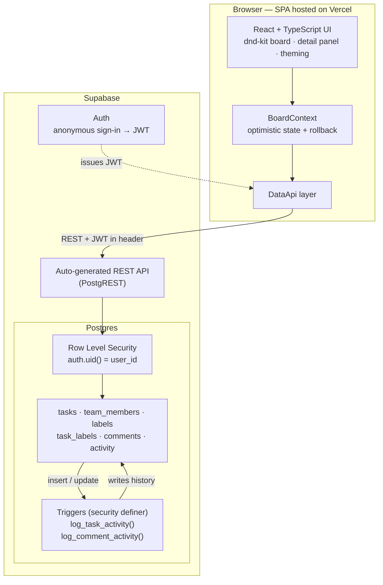

# Tempo

A Kanban task board inspired by Linear and Asana. Built with React + TypeScript + Vite on the frontend and Supabase (Postgres, anonymous auth, RLS) for persistence.

## Features

- **Board** — To Do / In Progress / In Review / Done columns with smooth drag-and-drop (dnd-kit), optimistic updates, and rollback on failure
- **Guest accounts** — Supabase anonymous sign-in on first launch; Row Level Security ensures each guest sees only their own data
- **Tasks** — title, description, priority, due date, assignee, labels
- **Team members** — create a small team with colored avatars, assign tasks
- **Comments** — per-task comment thread with timestamps
- **Activity log** — Postgres triggers record status changes, edits, assignments, and comments server-side
- **Labels** — colored labels with multi-select per task and board filtering
- **Due-date indicators** — overdue / due-soon badges on cards
- **Search & filters** — by title, priority, assignee, label
- **Board stats** — total / done / overdue chips in the header
- Loading skeletons, empty states, error states with retry, responsive layout

## Run locally

```bash
npm install
cp .env.example .env.local   # fill in your Supabase URL + anon key
npm run dev
```

Without env vars the app falls back to a localStorage mock (dev-only convenience); with them it uses Supabase.

## Supabase setup

1. Create a free project at supabase.com
2. Authentication → Sign In / Up → enable **Anonymous sign-ins**
3. SQL Editor → run [`supabase/schema.sql`](supabase/schema.sql)
4. Project Settings → API → copy the URL and anon key into `.env.local`

## Architecture notes

- The frontend calls Supabase directly through a thin `DataApi` interface ([src/lib/api.ts](src/lib/api.ts)); RLS is the security boundary, so no server of our own is required.
- The activity log is written by `security definer` triggers in Postgres, not by the client — it can't drift from actual writes.
- Card ordering uses fractional `sort_order` values, so a drop writes exactly one row.

### Data flow


